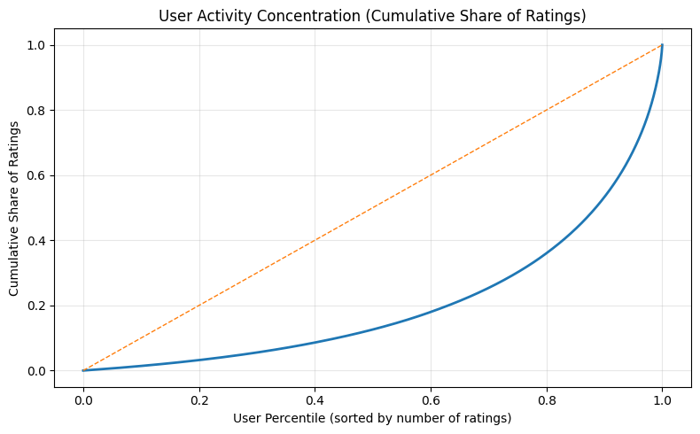
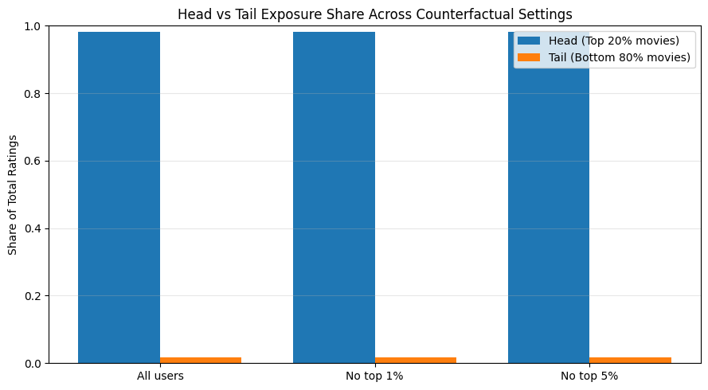
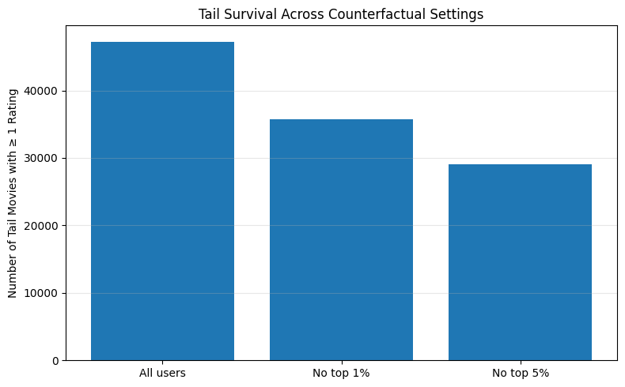
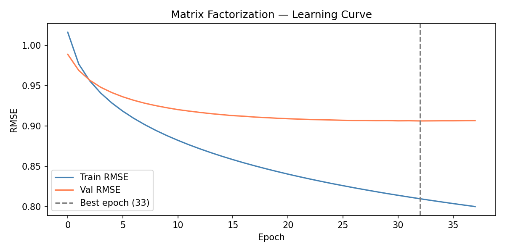

# Analytic Report — MovieLens Behavioral Recommender

> **프로젝트 한 줄 요약**: 추천 시스템의 인기 편향(popularity bias)을 진단하고, 그것을 실제로 측정할 수 있는 지표를 구현하고, 편향을 완화하기 위한 실험을 설계하는 전 과정을 처음부터 구현한다.

---

## 목차

1. [프로젝트 배경 및 동기](#1-프로젝트-배경-및-동기)
2. [데이터셋 개요](#2-데이터셋-개요)
3. [Phase 1 — 인기 편향 진단](#3-phase-1--인기-편향-진단)
4. [Phase 2 — 모델 구현 및 평가](#4-phase-2--모델-구현-및-평가)
5. [평가 지표 심층 분석](#5-평가-지표-심층-분석)
6. [A/B 실험 설계](#6-ab-실험-설계)
7. [주요 발견 및 한계](#7-주요-발견-및-한계)
8. [다음 단계](#8-다음-단계)

---

## 1. 프로젝트 배경 및 동기

추천 시스템에는 구조적 문제가 있다. **인기 있는 아이템은 더 많은 상호작용 데이터를 얻고 → 더 정확하게 추천되고 → 더 많이 소비되는** 양의 피드백 루프가 형성된다. MovieLens 25M 데이터에서 상위 20% 아이템이 전체 평점의 **98.26%** 를 차지할 정도로 편향이 극단적이다. 긴 꼬리(long-tail)에 있는 아이템들은 학습 신호가 부족해 점점 더 추천에서 배제된다.

이 프로젝트는 다음 세 가지 질문을 순서대로 답한다:

| 단계 | 질문 |
|------|------|
| **진단** | 인기 편향은 소수의 파워 유저 때문인가, 아니면 데이터 구조 자체의 문제인가? |
| **측정** | MF 모델이 실제로 편향을 얼마나 증폭시키는가? |
| **처방** | 편향을 줄이는 가장 단순한 개입(inference-time penalty)이 효과가 있는가? |

---

## 2. 데이터셋 개요

**MovieLens 25M** — GroupLens Research에서 공개한 영화 평점 데이터셋

| 항목 | 수치 |
|------|------|
| 총 평점 수 | ~25,000,000 |
| 사용자 수 | ~162,000 |
| 영화 수 | ~59,000 |
| 평점 범위 | 0.5 ~ 5.0 (0.5 단위) |
| 타임스탬프 | 1995 ~ 2019 |

**전처리 주요 결정사항** (`01_load_and_validate.ipynb`)

- 타임스탬프를 `datetime`으로 변환 → 행동 연구에 필요한 시간 기반 분석 가능
- 평점 분포, 중복 여부, null 체크 포함 sanity check 실행
- 처리된 데이터를 Parquet 포맷으로 저장 (`data/processed/`)

```
data/processed/
├── ratings.parquet          # 기본 평점 데이터
├── ratings_enriched.parquet # 사용자 행동 피처 추가
├── movies.parquet           # 영화 메타데이터
├── user_behavior.parquet    # 사용자별 활동 집계
└── movie_exposure.parquet   # 영화별 노출 집계
```

---

## 3. Phase 1 — 인기 편향 진단

### 3.1 핵심 질문

> 긴 꼬리 아이템의 낮은 노출이 파워 유저 때문이라면, 그들을 제거하면 문제가 완화되어야 한다.

이것이 반사실적(counterfactual) 분석의 출발점이다.

### 3.2 사용자 활동 집중도



**해석**: 상위 11%의 사용자가 전체 평점의 50%를 생성한다. 더 세분화하면:

| 활동 그룹 | 사용자 비율 | 평점 기여도 |
|-----------|------------|------------|
| Extreme (상위 1%) | 1% | 12.2% |
| Ultra | 상위 4% | ~25% |
| Power | 상위 10% | ~47% |
| Active | 중간 40% | ~40% |
| Quiet (하위 50%) | 50% | 12.6% |

모델이 이 데이터로 학습되면, 상위 소수 사용자의 행동 패턴을 전체 사용자의 것으로 일반화하게 된다.

### 3.3 반사실적 분석 결과

**가설**: 파워 유저를 제거하면 head/tail 노출 비율이 변할 것이다.



**실제 결과**: 상위 1%를 제거해도, 상위 5%를 제거해도 head 아이템(상위 20%)이 전체 평점의 **98% 이상**을 차지하는 구조는 변하지 않는다.

> 📌 **핵심 발견**: 인기 편향은 특정 사용자 집단의 문제가 아니다. **상호작용 데이터 자체의 구조적 속성**이다.

### 3.4 꼬리 생존율 분석



단, 파워 유저 제거가 완전히 영향 없는 것은 아니다. **꼬리 아이템이 단 1개라도 평점을 받는 비율(tail survival)**은 파워 유저 제거 시 감소한다.

이는 파워 유저들이 꼬리 아이템을 "살아있게" 유지하는 역할을 하지만, 전체 노출 비율 자체를 바꾸지는 못한다는 것을 의미한다.

---

## 4. Phase 2 — 모델 구현 및 평가

### 4.1 Matrix Factorization 구현 (`src/mf_model.py`)

numpy만으로 SGD 기반 행렬 분해를 처음부터 구현했다. 외부 추천 라이브러리(Surprise, implicit 등) 없이.

**모델 수식**:

$$\hat{r}_{ui} = \mu + b_u + b_i + \mathbf{p}_u \cdot \mathbf{q}_i$$

| 파라미터 | 의미 |
|----------|------|
| $\mu$ | 전체 평균 평점 (global mean) |
| $b_u$ | 사용자 편향 — 이 사람은 전반적으로 후하게/박하게 주는가? |
| $b_i$ | 아이템 편향 — 이 영화는 전반적으로 좋게/나쁘게 평가받는가? |
| $\mathbf{p}_u \cdot \mathbf{q}_i$ | 사용자-아이템 잠재 요소 상호작용 |

**L2 정규화 손실 함수**:

$$\mathcal{L} = \sum_{(u,i) \in \text{obs}} (r_{ui} - \hat{r}_{ui})^2 + \lambda \left( \|\mathbf{p}_u\|^2 + \|\mathbf{q}_i\|^2 + b_u^2 + b_i^2 \right)$$

**하이퍼파라미터**:

| 파라미터 | 값 | 선택 이유 |
|---------|-----|----------|
| `n_factors` | 20 | 과적합 방지 / 계산 효율 균형 |
| `lr` | 0.005 | 수렴 안정성 |
| `lambda_` | 0.05 | 과적합 방지 |
| `patience` | 5 | Early stopping 기준 |

### 4.2 학습 과정



| 결과 | 수치 |
|------|------|
| 최적 epoch | 33 |
| Best val RMSE | **0.9062** |
| 조기 종료 epoch | 38 |
| Train/val gap | ~0.10 |

**설계 결정의 영향**:

처음 bias 항 없이 학습했을 때 train/val 격차가 **0.65**까지 벌어졌다. Bias 항 (`b_u`, `b_i`) 추가 후 격차가 **0.10**으로 줄었다. 이는 평점 분산의 상당 부분이 단순히 "이 사용자는 높게 주는 경향" 또는 "이 영화는 낮게 평가받는 경향"으로 설명된다는 것을 보여준다.

---

## 5. 평가 지표 심층 분석

RMSE만으로는 추천 품질을 평가하기 충분하지 않다. 4개의 지표를 직접 구현해 입체적으로 분석했다.

### 5.1 최종 결과 요약

| 지표 | 값 | 해석 |
|------|-----|------|
| RMSE (test) | 0.9309 | 평점 예측 오차 ~1점 미만 |
| **NDCG@10** | **0.9502** | 랭킹 품질 우수 (닫힌 세계) |
| **Catalog Coverage** | **0.07%** (12/16,825) | ⚠️ 심각한 인기 편향 |
| **Long-tail Exposure Rate** | **0.5980** | ⚠️ 이상적 목표치 0.80 대비 낮음 |

### 5.2 지표 간 긴장 관계

```
높은 NDCG@10 (0.95)
        ↕
낮은 Catalog Coverage (0.07%)
```

이 모순이 이 프로젝트의 핵심 통찰이다.

- **NDCG@10 = 0.95**: 닫힌 세계 평가 — "사용자가 이미 본 영화 중 어떤 것이 더 좋은가?" 를 잘 예측한다
- **Coverage = 0.07%**: 열린 세계 평가 — 추천 시 실제로 전체 카탈로그의 0.07%만 사용한다

즉, 모델은 **이미 알려진 것을 잘 랭킹하지만, 새로운 것을 발견시켜주지 못한다**. Phase 1에서 발견한 구조적 편향이 모델 추천에 그대로 증폭된다.

### 5.3 왜 이런 일이 발생하는가?

```
인기 아이템
  → 더 많은 학습 데이터
  → b_i 편향 항이 더 잘 최적화됨
  → 추론 시 더 높은 점수
  → 더 많이 추천됨
  → (피드백 루프)
```

꼬리 아이템은 학습 신호가 부족해 `b_i`와 `q_i`가 불확실한 채로 남고, 불확실한 아이템보다 확실한(인기) 아이템이 항상 높은 점수를 받게 된다.

---

## 6. A/B 실험 설계

### 6.1 개입 방법

가장 단순한 편향 완화: **재학습 없이 추론 시점에 인기 패널티 적용**

| 변형 | 점수 함수 |
|------|----------|
| 대조군 (Control) | $\text{score}(u, i) = \mu + b_u + b_i + \mathbf{p}_u \cdot \mathbf{q}_i$ |
| 실험군 (Treatment) | $\text{score}(u, i) = \mu + b_u + b_i + \mathbf{p}_u \cdot \mathbf{q}_i - \alpha \cdot \log(\text{count}(i) + 1)$ |

`α`는 패널티 강도를 조절하는 하이퍼파라미터. `α ∈ {0.0, 0.1, 0.2, 0.5, 1.0, 2.0}` sweep으로 최적값 탐색.

### 6.2 지표 체계

```
Primary (최대화)
  └─ Long-tail Exposure Rate ↑

Guardrail (허용 범위 이내 유지)
  └─ NDCG@10 ≥ control × 0.95  (−5% 이상 하락 불가)

기대 개선
  └─ Catalog Coverage ↑  (제약 없음, 자연스러운 개선 예상)
```

### 6.3 실험의 한계 (정직한 평가)

| 한계 | 설명 |
|------|------|
| 실제 사용자 만족도 미측정 | NDCG는 프록시. 실제 CTR, 시청 시간, 명시적 피드백 없음 |
| 콜드 스타트 미처리 | 샘플된 사용자는 모두 학습 이력 보유 |
| 시간 순서 무시 | Train/test 분할이 랜덤. 실제 배포 시뮬레이션엔 시간 기반 분할 필요 |
| 네트워크 효과 미포함 | 오프라인 실험으로는 사용자 간 상호작용 효과 측정 불가 |

---

## 7. 주요 발견 및 한계

### ✅ 확인된 것들

1. **편향은 파워 유저가 아닌 데이터 구조의 문제** — 반사실적 분석으로 검증
2. **MF 모델은 편향을 증폭** — Coverage 0.07%가 이를 수치로 증명
3. **RMSE ≠ 추천 품질** — NDCG 0.95이면서 Coverage 0.07%라는 모순이 이를 보여줌
4. **Bias 항의 중요성** — 추가만으로 overfitting 격차 0.65 → 0.10

### ⚠️ 현재 한계

- MF가 SGD로 학습되어 느림 (ALS 또는 배치 최적화 대비)
- NDCG는 닫힌 세계 평가만 수행 — 오픈 월드 평가 필요
- `sql/` 폴더의 `behavioral_metrics.sql`, `eda_queries.sql`, `schema.sql`은 현재 비어있음 — 향후 SQL 기반 분석 확장 예정

---

## 8. 다음 단계

| 우선순위 | 작업 | 설명 |
|----------|------|------|
| 🔴 높음 | `05_popularity_penalty.ipynb` | A/B 실험 실제 실행 및 α sweep |
| 🔴 높음 | `src/metrics.py` 리팩토링 | NDCG, LTE, coverage 함수 모듈화 |
| 🟡 중간 | 시간 기반 Train/Test 분할 | 실제 배포 시나리오 시뮬레이션 |
| 🟡 중간 | SQL 쿼리 작성 | `behavioral_metrics.sql`, `eda_queries.sql` 채우기 |
| 🟢 낮음 | ALS 구현 | SGD 대비 수렴 속도 비교 |
| 🟢 낮음 | 콜드 스타트 처리 | 신규 사용자/아이템 대응 전략 |

---

## 부록 — 파일 구조

```
movielens-behavioral-recommender/
├── notebooks/
│   ├── 01_load_and_validate.ipynb    # 데이터 로드 및 전처리
│   ├── 02_user_behavior.ipynb        # Phase 1: 반사실적 분석
│   ├── 03_matrix_factorization.ipynb # Phase 2: MF 구현 및 학습
│   └── 04_evaluation_metrics.ipynb   # Phase 2: 4개 지표 평가
├── src/
│   └── mf_model.py                   # MatrixFactorization 클래스
├── docs/
│   └── ab_test_design.md             # 실험 설계 문서
├── images/
│   ├── user_dominance_curve.png      # 사용자 활동 집중도 곡선
│   ├── head_tail_exposure.png        # 반사실적 노출 비교
│   ├── tail_survival.png             # 꼬리 아이템 생존율
│   └── loss_curve.png                # MF 학습 곡선
├── sql/
│   ├── schema.sql                    # 데이터 스키마 정의
│   ├── eda_queries.sql               # EDA SQL 쿼리 (작성 예정)
│   └── behavioral_metrics.sql        # 행동 지표 쿼리 (작성 예정)
├── data/
│   ├── raw/                          # MovieLens 25M 원본 CSV
│   └── processed/                    # 전처리된 Parquet 파일
└── requirements.txt
```

---

*분석 완료일: 2026-05-26 | 데이터: MovieLens 25M | 구현: NumPy, Pandas, Matplotlib*
