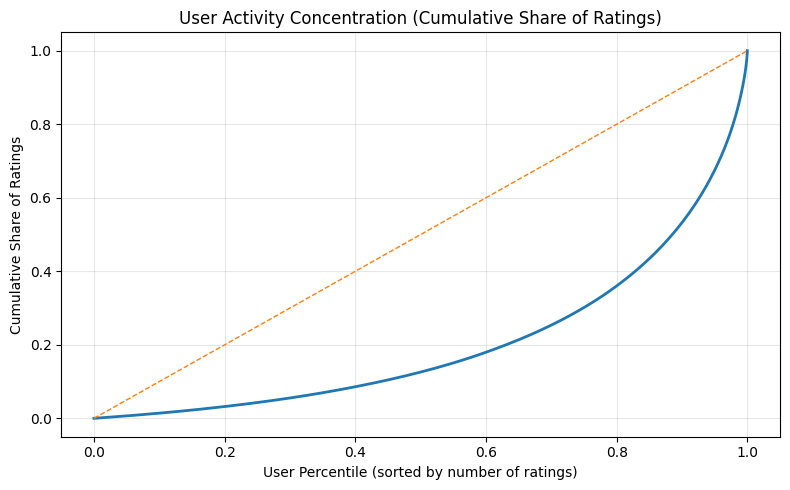
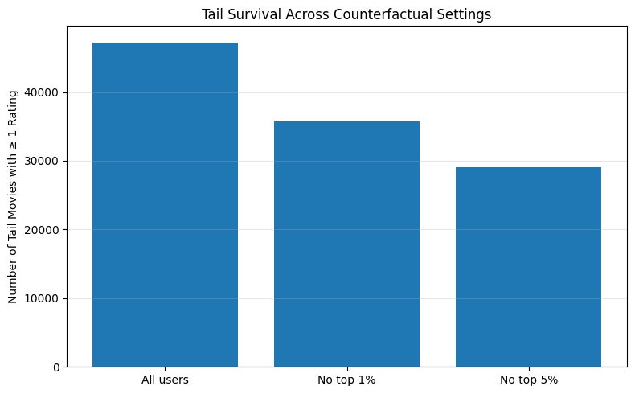

# Diagnosing Structural Popularity Bias in Recommender Interaction Data

## Overview
Recommender systems are often criticized for over-exposing popular items while failing to surface the long tail. A common assumption is that this bias is primarily driven by a small subset of highly active “power users” who dominate interaction data.

This project tests that assumption.

Using the MovieLens 25M dataset, I conduct a behavioral and counterfactual analysis to examine whether long-tail under-exposure is caused by highly active users—or whether it emerges as a structural property of interaction data itself.

---

## Research Question
**Is long-tail under-exposure in recommender systems driven by a small number of highly active users, or is it a structural characteristic of user–item interaction data?**

---

## Motivation
In practice, personalization systems often feel repetitive:
- recommendations converge on the same popular items
- niche or less-popular content struggles to gain visibility
- increasing data volume does not necessarily improve diversity

A widely held intuition is that this happens because:
> “Power users dominate the data, so the system learns their preferences.”

This project directly tests that intuition rather than assuming it.

---

## Dataset
- **MovieLens 25M**
- ~25 million explicit ratings
- ~162k users, ~59k movies

Each rating is treated as a learning signal available to a recommender system.

---

## Methodology

### 1. User Activity Stratification
Users are ranked by the number of ratings they contribute and grouped by activity percentiles:

- Quiet (bottom 50%)
- Active (50–90%)
- Power (90–95%)
- Ultra (95–99%)
- Extreme (top 1%)

This allows quantification of how unevenly learning signals are distributed across the user population.

---

### 2. Learning Signal Dominance
I measure how much of the total rating volume is generated by each user group.

**Key result:**
- Top 1% of users contribute ~12% of all ratings
- Top 10% of users contribute ~47% of all ratings
- Bottom 50% of users contribute ~12.5% of all ratings

This confirms that learning signals are highly concentrated among a small subset of users.

---

### 3. Counterfactual Sensitivity Analysis
To test whether these highly active users *cause* popularity bias, I construct counterfactual datasets:

- **Baseline**: all users
- **No top 1% users**
- **No top 5% users**

The only change across these datasets is the removal of specific user groups. No reweighting or model assumptions are introduced.

---

### 4. Item-Level Exposure Analysis
Movies are ranked by exposure (number of ratings received) and split into:
- **Head**: top 20% most-rated movies
- **Tail**: bottom 80% of movies

I compute **Tail Exposure Share (TES)**:
> the proportion of total rating volume allocated to tail movies

TES is measured consistently across all counterfactual settings.

---

## Key Findings

### 1. Extreme User Dominance Does Not Explain Tail Suppression
Across all settings:
- The top 20% of movies receive **over 98% of all ratings**
- The bottom 80% of movies receive **less than 2% of all ratings**

Removing the top 1% or even the top 5% of users produces **only marginal changes** in tail exposure share.

---

### 2. Popularity Bias Is Structural
Although highly active users dominate learning signal volume, their removal does **not** meaningfully rebalance exposure between head and tail items.

This indicates that:
> **Long-tail under-exposure is not primarily driven by power users, but emerges as a structural property of interaction data itself.**

---

### 3. What Changes—and What Does Not
- **What changes**:
  - item ranking stability
  - which tail movies receive *any* exposure
- **What does not change**:
  - aggregate exposure allocation between head and tail

The system remains overwhelmingly head-dominated even after removing dominant users.

---
## Visual Summary

### User activity concentration


### Head vs tail exposure share (counterfactual removal)


### Tail survival (catalog coverage)


---

## Implications

### For Recommender Systems
- Algorithmic tuning alone cannot resolve popularity bias if the underlying data is already highly concentrated.
- Removing or down-weighting power users is insufficient to surface the long tail.
- Structural bias must be addressed at the level of data collection, interaction design, or exposure incentives.

### For Product & UX
- Personalization may feel repetitive not because users lack diverse taste, but because interaction mechanisms amplify already-visible items.
- Supporting exploration and deliberate tail exposure requires intervention beyond passive feedback signals.

---

## What This Project Is—and Is Not

**This project is:**
- a diagnostic analysis of recommender learning signals
- a counterfactual audit of structural bias
- an investigation into why popularity bias persists

**This project is not:**
- a recommender model implementation
- an accuracy optimization exercise
- a proposal of a “fairness fix”

---

## Conclusion
Even when highly active users are removed, recommender interaction data remains overwhelmingly concentrated on popular items. This suggests that long-tail under-exposure is not an artifact of user dominance, but a fundamental characteristic of how interaction data is generated and accumulated.

Understanding this structural constraint is a necessary step before proposing algorithmic or product-level interventions.

---

## Project Structure
```
notebooks/
├── 01_data_prep.ipynb        # Data loading and preprocessing
└── 02_user_behavior.ipynb   # User activity analysis and counterfactual sensitivity tests

data/                         # Raw and processed data (ignored)
sql/                          # SQL experiments and scratch work (ignored)
```
---

## Future Work
- Counterfactual reweighting of user contributions
- Per-user contribution caps
- Exploration-aware data collection strategies
- Extension to implicit-feedback datasets

---

## Author
Jiwoo (Lucy) Roh  
Behavioral Data Analysis · UX Research · Recommender Systems